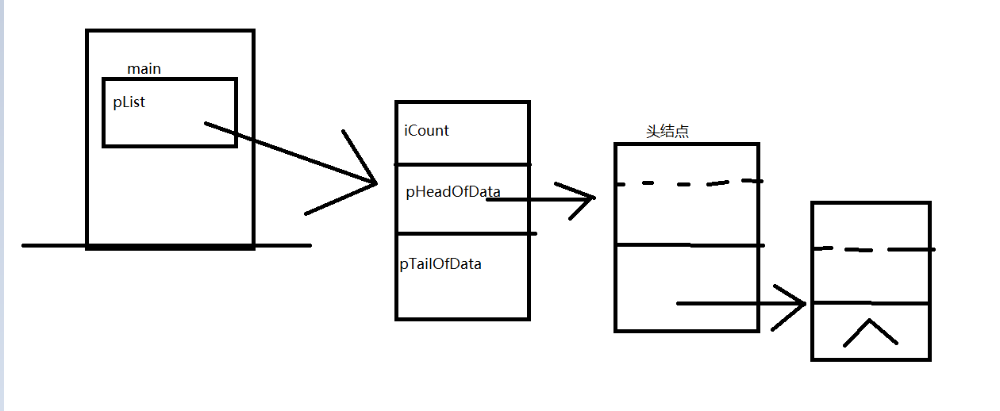
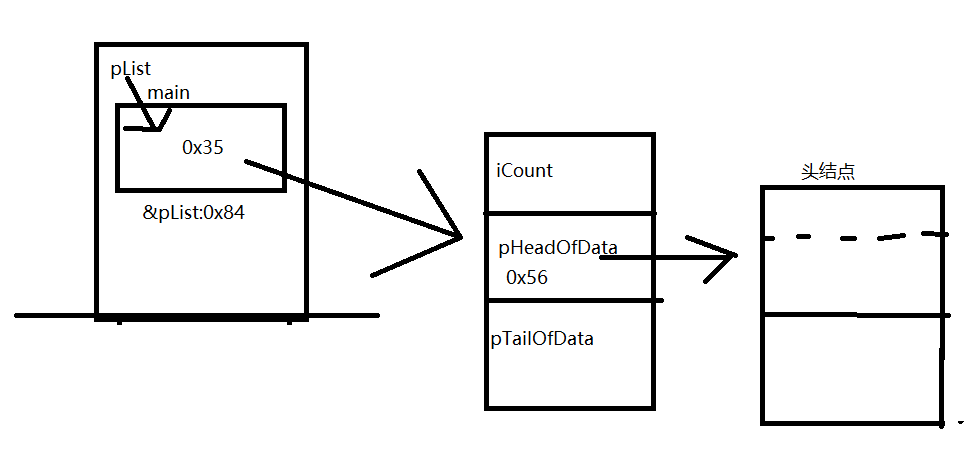
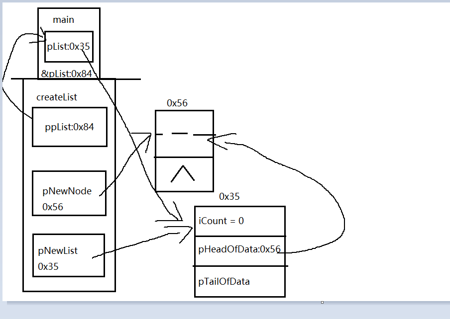
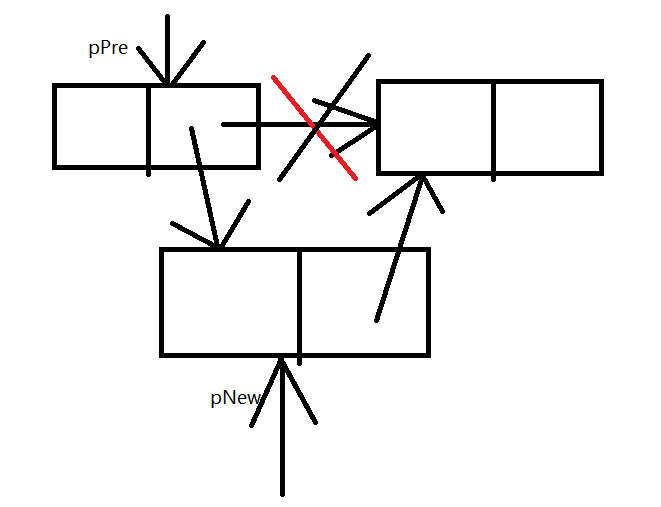
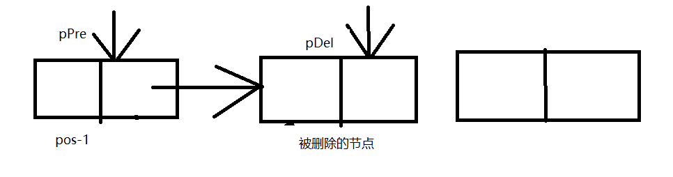

### 线性表——链表的理解1

@(线性表)[链表]

#### 需要定义的量
1.单个数据的定义

	typedef struct  person
	{
		long ID;           //4
		char name[20];     //20
	}Elemtype;
2.定义单个数据节点

	typedef struct NODE
	{
		Elemtype	data;  //28
		struct NODE *next; //4 
	}NODE, *pNODE;
3.定义整个链表

	 typedef struct LIST
	{
		int	Count;                
		struct NODE *pHeadOfData; 
		int minValue;
		struct NODE *pTailOfData;//以方便快速定位到表尾结点（在数据的尾插法中可以用到）
		// ......
	}LIST, *LINKLIST;              //如果定义对象，则每个对象有4+4+4+4=16个字节

--- 
##### 用面向对象的思想需要考虑的问题：

 int iCount;

数据个数，即表长。该信息使用频繁，3种思路可做：
   1. 定义为pubblic权限的成员变量Count，增删清空等时候维护该变量，获取时直接以list1.Count的形式返回——有安全风险，且容易引发混乱，不提倡
   2. 定义成成员方法getCount()的形式，调用方法，临时去计算并返回长度值。                           ——计算费时，不适合频繁使用，尤其是数据量很大的时候
  3.定义为private权限的成员变量Count，增删清空等时候维护该变量，获取时用public权限的成员方法getCount()去读取该变量。——这是实际普遍使用的方式

---

##### 1.基本想法

---

##### 2.创建函数

最终结果：

具体操作：

	int createList(LIST **ppList)  //一般我们都将指向单链表第一个结点（或表头结点）的指针命名为head，这是习惯约定
	{
		struct LIST *pNewList;
		struct NODE *pNewNode;
		if (ppList==NULL)             
			return PARAM_ERROR;
	
		//创建一个表头结点，并用pNewList指向该空间
		pNewNode = (struct NODE *)malloc(sizeof(struct NODE));  //申请空间，注意：申请的是一个表结点的空间(28个字节)
		if (pNewNode==NULL)
		{
			return MALLOC_ERROR;
		}
		memset(pNewNode, 0, sizeof(struct NODE));//void *memset(void *s,int c,size_t n)
	                                              
		pNewNode->next = NULL; 
	
	
		//创建一个表对象的空间，并用pNewList指向该空间
		pNewList = (struct LIST *)malloc(sizeof(struct LIST));  
		if (pNewList==NULL)
		{
			free(pNewNode);     
			return MALLOC_ERROR;
		}
		memset(pNewList, 0, sizeof(struct LIST));
		pNewList->Count= 0;   
		pNewList->pHeadOfData = pNewNode;  
		*ppList = pNewList; 
		return 0;        
	}
##### 3.输出值
 
	 p= pList->pHeadOfData->next;
	 while( p ! = NULL)
	 {
	      p = p->next;
	 }
###### 4.插入
 int Insert(LIST *pList, Elemtype value, int pos)

除了应该校验等的内容以外
接下来的第一步：将内容写入pNew中
第二步：找到要插入的pos位置，传入&pPre 去另外一个函数中找位置
第三步：插入

>pNew->next = pPre->next;
pPre->next = pNew;
iCount++;

##### 5.删除

int DelByPos(struct LIST *pList, int pos, Elemtype *pValue)

*pValue 是为了防止数据的丢失，储存起来

1.先找到pos-1的位置
2.存下要被删除的那个的位置
 pDel = pPre->next;
 3.删除
 >pPre->next = pPre->next ->next;
 free(pDel);
 pDel = NULL;
 iCount--;

##### 6.找位置
int SearchByPos(LIST *pList, int pos, NODE **ppNode)

while ( i<pos && p->next!= NULL) //当没有数到逻辑顺序的第i个结点 并且 还没有到表尾的时候，则
	{
		p= p->next;          //一边将p指针指向下一个结点
		i++;				 //一边计数
	}

分为两种情况：
1.找到了，就是i<pos
2.没找到，及时p->next = NULL;
